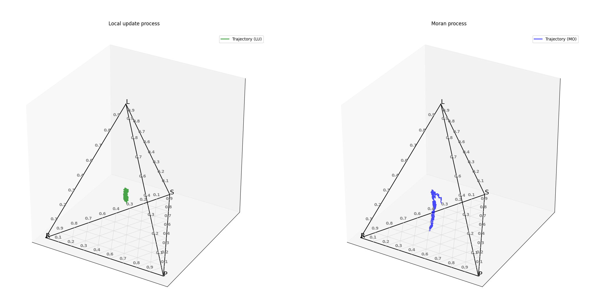
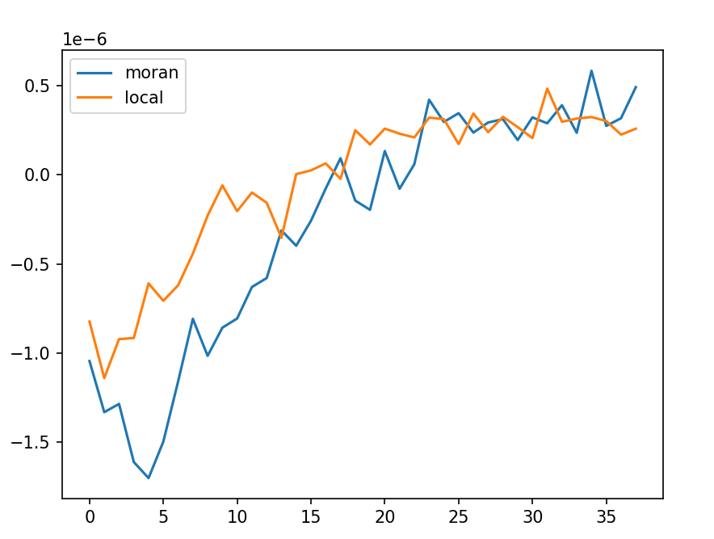

# GTfyp
Final year project work - evolutionary game theory 

Basic RPS example: 

Example of drift reversal:

LU, MO, and numerical integration result for a particular payoff matrix. 1000000 iterations.

Simulation code contained in the source/simulation subdirectory - for offline and adjusting

backend/ for django backend - hope to create a rest api for the simulations in aim to produce an interactive web app.

Now contains support for 2d games - below is prisoners dilemma plot with numerical solutions for adjusted and standard replicator dynamics.

Example hawk dove simulation - note in this photo only the local update and regular numeric is corrcect - adjusted needs implementing correctly.

Also now contains 2d ternary plots for regular 3x3 matrix games.

[insert photo here]

Drift analysis:

Need to include detail of running both web app and python app locally with docker, setup docker pipeline for app.

gitlab test 2