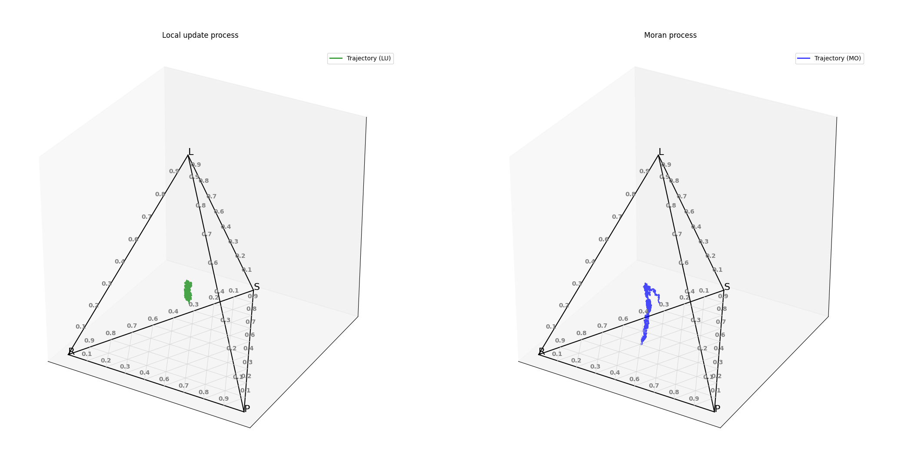

# GTfyp
Final year project work - evolutionary game theory 

Contains 3d plotting for 4 strategy games.

Basic RPS example: 

Example of moran process drift reversal:

population 100, w = 0.3 in the augmented RPS game. Only in moran process (right) drift reversal occurs at this lower population.