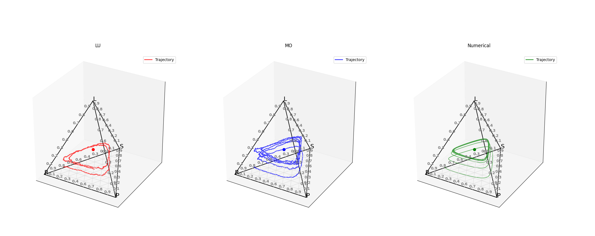
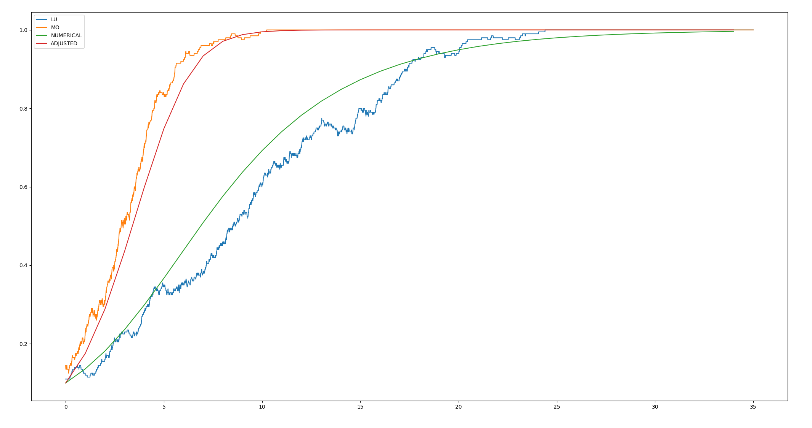
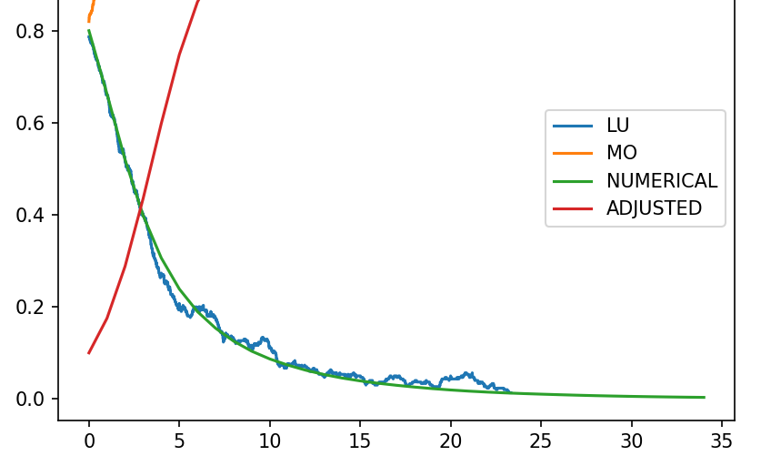
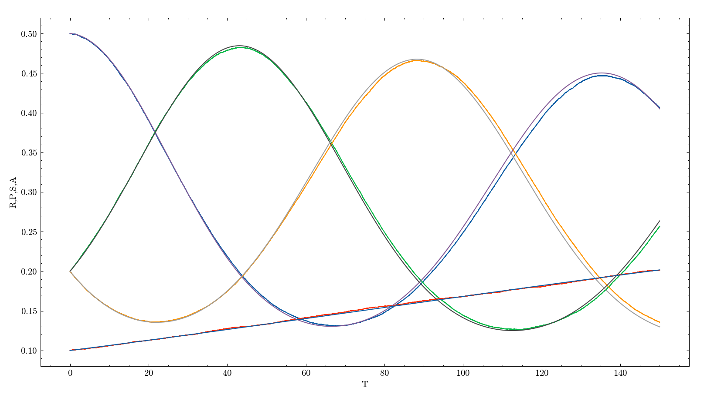

# GTfyp
Final year project work - evolutionary game theory 

For full report and the final submission report see source latex in /latex_doc.

For full derivations of all formula - see the full uncut document.
For supporting hand written derivations see /hand_written_derivations

pip install git+https://github.com/purgz/GTfyp.git

# Documentation.

More documentation in simulation folder - add this, 

Convert simulation to a library downloadable with pip and provide a code example. (/example_code)

### Commands

Preset examples:
python app.py pd [Optional args]
python app.py rps [Optional args]
Optional Commands:
  - -N \<pop size\>
  - -iterations
e.g. python app.py -N 5000 -iterations 10000
Iterations automatically calculated if not provided for 35 normalized timesteps in pd example.

-matrix argument in progess for general example with numerical solution.
pd example is will be generally any 2x2 symmetric game with matrix argument option.
replicators and integral solutions automatically calculated.

---

Up to date document with derviations and more images in /latex_doc/main.pdf

- aim for the project - general game simulator with time series plots for 2x2,3x3,4x4..NxN wth numerical trajectories options.
- drift analysis, different interaction processes, unique plots and animations particularly for 4x4.
- main focus is on 4x4 game (RPS + SD) 

aug_rps, analytical solutions for delta H observation value, and calculation of critical population sizes. 

Basic RPS example: 

LU, MO, and numerical integration result for a particular payoff matrix. 1000000 iterations.

Simulation code contained in the source/simulation subdirectory - for offline and adjusting

Now contains support for 2d games - below is prisoners dilemma plot with numerical solutions for adjusted and standard replicator dynamics.

Example hawk dove simulation - note in this photo only the local update and regular numeric is corrcect - adjusted needs implementing correctly.

Also now contains 2d ternary plots for regular 3x3 matrix games.

[insert photo here]

Drift analysis:
Include some examples here.

Need to include detail of running both web app and python app locally with docker, setup docker pipeline for app.

Local update simulation for the 4 player game, can see how it follows the numerical solution at very large pop (100000). 15,000,000 iterations, normalized to 150 time-steps.