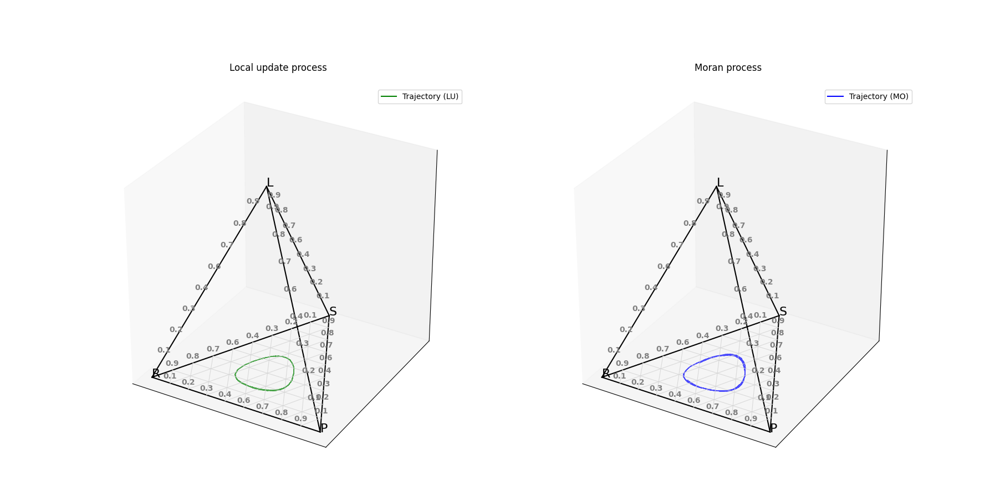
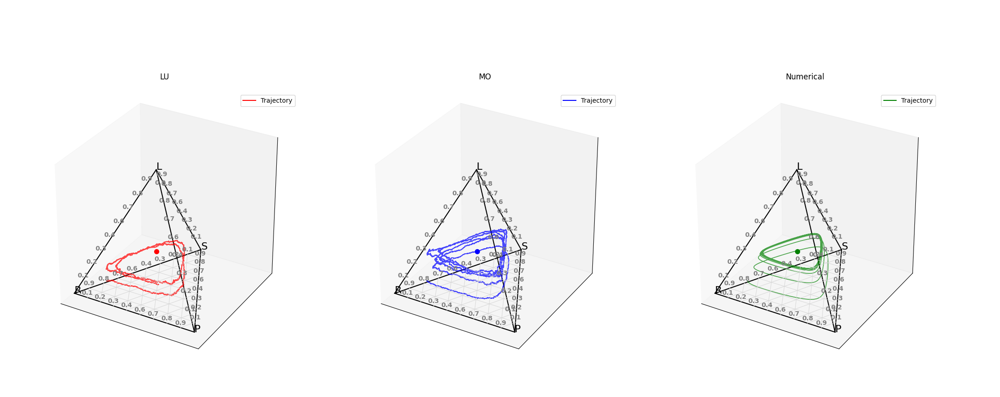
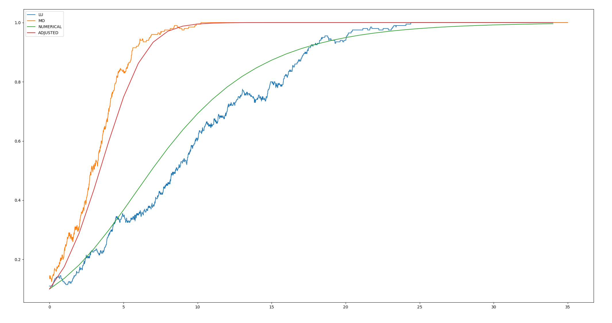
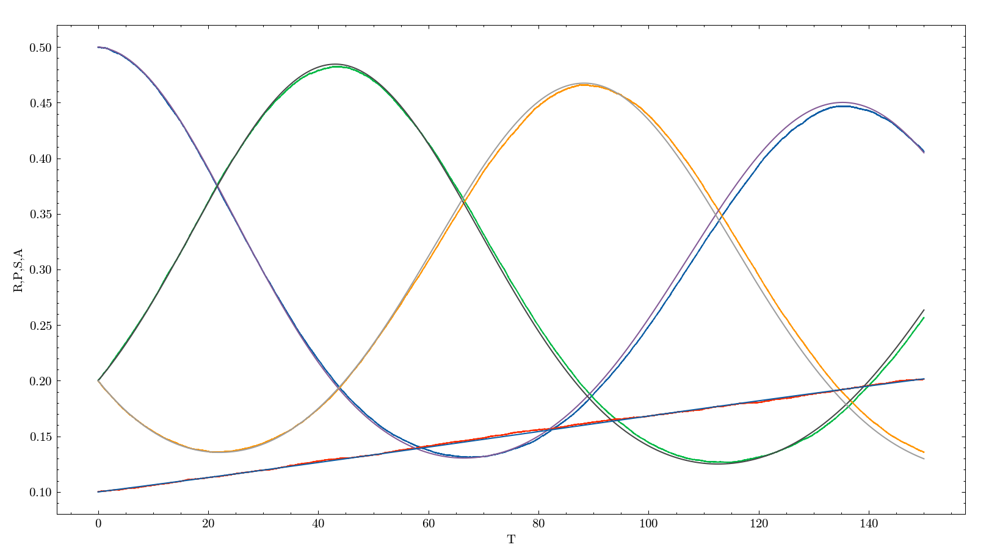

# Final year project - Evolutionary game theory

Final report and appendix contained in [./report](./report).

Full derivations contained in appendix.

Install using pip:

pip install git+https://github.com/purgz/GTfyp.git

More documentation in simulation folder - add this, 

Example usage in [./example_code](./example_code), and more instructions in [./source/README.md](./source/README.md)

### Commands

Preset examples:
python app.py pd [Optional args]
python app.py rps [Optional args]
Optional Commands:
  - -N \<pop size\>
  - -iterations
e.g. python app.py -N 5000 -iterations 10000
Iterations automatically calculated if not provided for 35 normalized timesteps in pd example.

-matrix argument in progess for general example with numerical solution.
pd example is will be generally any 2x2 symmetric game with matrix argument option.
replicators and integral solutions automatically calculated.

---

#### Tools

Agent based simulation code and plotting tools in: [./source/simulation](./source/simulation) 

Symbolic derivations and solutions of replicator dynamics [./source/replicator](./source/replicator)

To calculate replicator dynamics solutions, eigenvalues, fixed points, and analytical values for drift reversal and critical population sizes for 4x4 game see functions in [./source/replicator/aug_rps.py](./source/replicator/aug_rps.py) 

### Example graphs

Up to date document with derviations and more images in /latex_doc/main.pdf

- aim for the project - general game simulator with time series plots for 2x2,3x3,4x4..NxN wth numerical trajectories options.
- drift analysis, different interaction processes, unique plots and animations particularly for 4x4.
- main focus is on 4x4 game (RPS + SD) 

aug_rps, analytical solutions for delta H observation value, and calculation of critical population sizes. 

Basic RPS example: 

LU, MO, and numerical integration result for a particular payoff matrix. 1000000 iterations.

Simulation code contained in the source/simulation subdirectory - for offline and adjusting

Now contains support for 2d games - below is prisoners dilemma plot with numerical solutions for adjusted and standard replicator dynamics.

Local update simulation for the 4 player game, can see how it follows the numerical solution at very large pop (100000). 15,000,000 iterations, normalized to 150 time-steps.